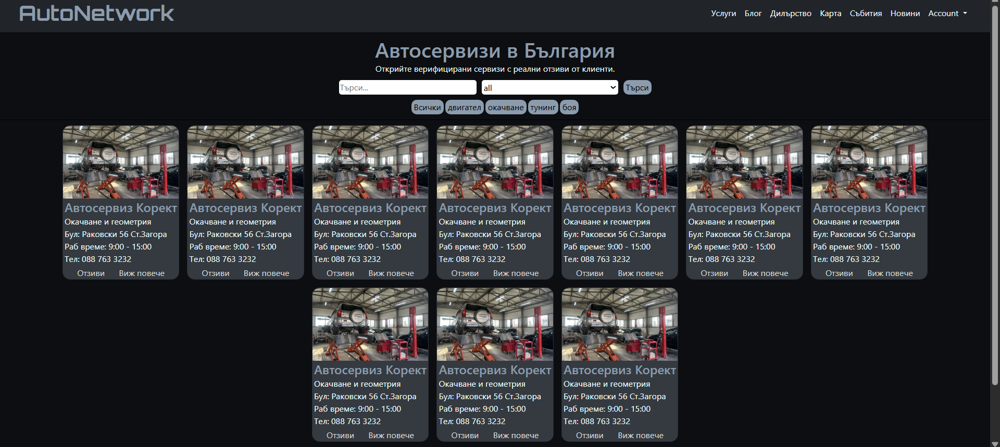
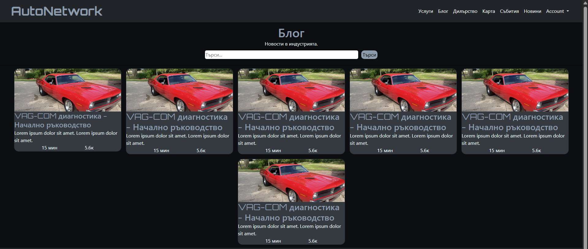
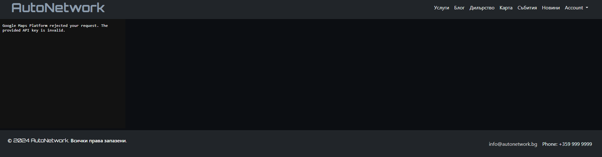

Technologies: HTML, CSS, BootStrap, PHP.

Functionalities:
  -login. 
  -logout. 
  -filters: (is user logged in, fullname(big small latin letters and _ ,15 simbols between 5 and 35 latin letters, valid email, pass atleast 1 upper and lower case 8 chars and special simbols(@-_ ~ |), valid phone number)(name - big small latin letters and _ ,15 simbols).

  -create read update delete product (drop down menu for categories).

  - data base with 3 tables categories(with CRUD) products users.

  -if you aren't logged in you can't view or work with data.

- database queries in database_queries.txt

Photos

